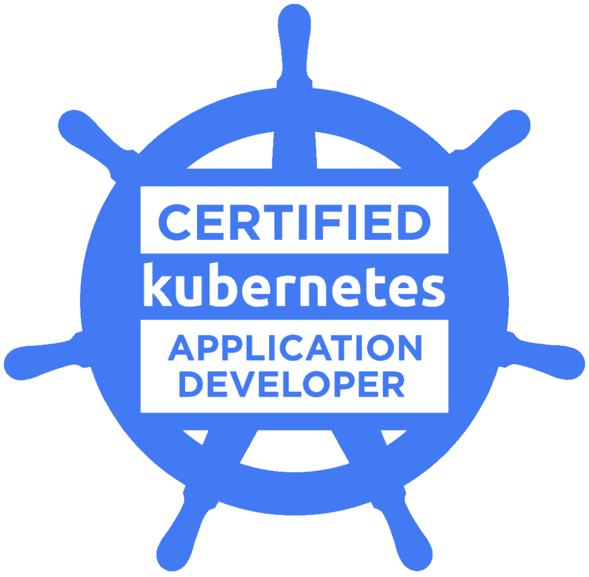

# CKA
This repository will be used in my studies to CKA (Certified Kubenetes Administrator) exam.

    

 
 

# Curriculum

## 25% - Cluster Architecture, Installation & Configuration

- [ ] Manage role based access control (RBAC)
- [x] Use Kubeadm to install a basic cluster
- [x] Manage a highly-available Kubernetes cluster
- [x] Provision underlying infrastructure to deploy a Kubernetes cluster
- [x] Perform a version upgrade on a Kubernetes cluster using Kubeadm
- [ ] Implement etcd backup and restore

## 15% - Workloads & Scheduling

- [x] Understand deployments and how to perform rolling update and rollbacks
- [x] Use ConfigMaps and Secrets to configure applications
- [x] Know how to scale applications
- [ ] Understand the primitives used to create robust, self-healing, application deployments
- [x] Understand how resource limits can affect Pod scheduling
- [x] Awareness of manifest management and common templating tools

## 20% - Services & Networking

- [x] Understand host networking configuration on the cluster nodes
- [x] Understand connectivity between Pods
- [x] Understand ClusterIP, NodePort, LoadBalancer service types and endpoints
- [ ] Know how to use Ingress controllers and Ingress resources
- [ ] Know how to configure and use CoreDNS
- [x] Choose an appropriate container network interface plugin

## 10% - Storage

- [ ] Understand storage classes, persistent volumes
- [ ] Understand volume mode, access modes and reclaim policies for volumes
- [ ] Understand persistent volume claims primitive
- [ ] Know how to configure applications with persistent storage

## 30% - Troubleshooting

- [x] Evaluate cluster and node logging
- [x] Understand how to monitor applications
- [x] Manage container stdout & stderr logs
- [ ] Troubleshoot application failure
- [ ] Troubleshoot cluster component failure
- [ ] Troubleshoot networking